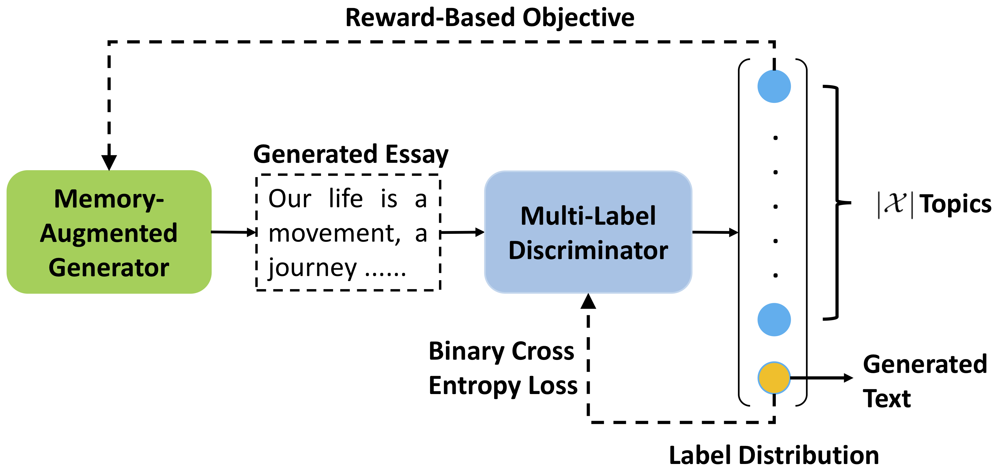
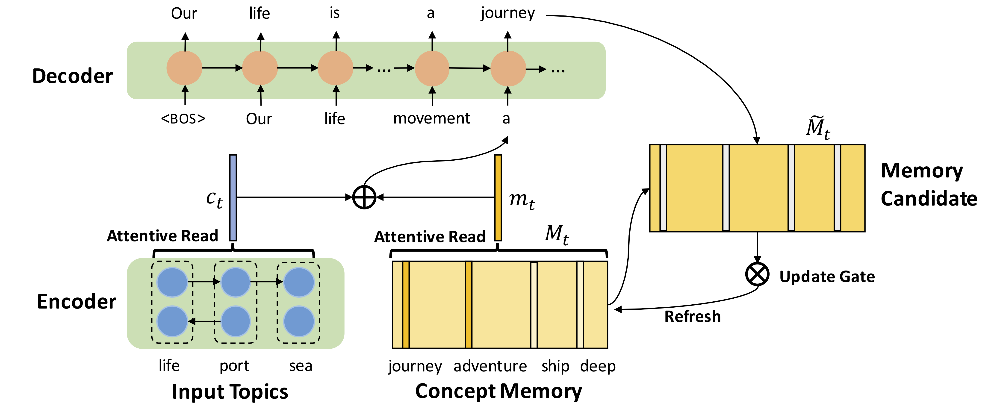

# CTEG 
**C**ommonsense enhanced **T**opic-to-**E**ssay **G**eneration: code for ACL 2019 paper **"Enhancing Topic-to-Essay Generation with External Commonsense Knowledge"**. 

Corresponding codes of MTA baselines can be found at [MTA-LSTM](https://github.com/TobiasLee/MTA-LSTM-TensorFlow).

## Model






## Requirements

- Python 3
- TensorFlow >= 1.7

## Data

Data can be downloaded from [Baidu Cloud](https://pan.baidu.com/s/17pcfWUuQTbcbniT0tBdwFQ)

## Run

1. Unzip the data and place it according to the path in `config.py`
2. Run `python3 cteg.py`

Feel free to contact [me](mailto:tobiaslee@foxmail.com) or raise an issue if you meet any problems.

## Citation

If you use this code or the corresponding baseline code, please kindly cite our paper:
```
@inproceedings{yang2019enhancing,
  title={Enhancing Topic-to-Essay Generation with External Commonsense Knowledge},
  author={Yang, Pengcheng and Li, Lei and Luo, Fuli and Liu, Tianyu and Sun, Xu},
  booktitle={Proceedings of the 57th Conference of the Association for Computational Linguistics},
  pages={2002--2012},
  year={2019}
}
```


